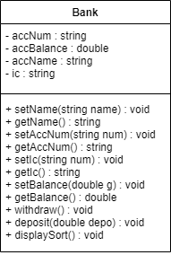

## PART 2 : SYSTEM DESIGN ##
### 2.1 System Class Design (Class Diagram) ###

 
Figure 1: Class Diagram for Bank Entity

#### 2.3.2 Searching Process (sequential search) ####
The system is applying a sequential search technique to search for the data. Data can be searched through the attribute. If the data exists, the whole piece of details will be returned as the output after the searching process is performed. In this process, users can search for their intended data by Name, Account Number and IC Number. Therefore, there exists three search functions for each attribute.
<ol>
  <li>Searching By Name (searchByName):</li>
  <ul>
    <li>Input: User provides the Name to search for.</li>
    <li>Algorithm:
      <ol>
        <li>User input name.</li>
        <li>Compare the input name with attribute ‘accName’ for each object.</li>
        <li>If a match is found, the information will be displayed for that specific ‘Bank’ object.</li>
        <li>The searching will continue until the end of the array.</li>
        <li>If no matching attribute is found, the system will display the error message.</li>
      </ol>
    </li>
  </ul>
   <li>Searching By Account Number (searchByAccNum)::</li>
  <ul>
    <li>Input: User provides the Account Number to search for.</li>
    <li>Algorithm:
      <ol>
        <li>Users input an account number.</li>
        <li>System iterates through the array of ‘Bank’ objects starting from index 0.</li>
        <li>Compare the input account number with attribute ‘accNum’ for each object.</li>
        <li>If a match is found, the information will be displayed for that specific ‘Bank’ object.</li>
        <li>The searching will continue until the end of the array.</li>
        <li>If no matching attribute is found, the system will display the error message.</li>
      </ol>
    </li>
  </ul>
   <li>Searching By IC (searchByIc):</li>
  <ul>
    <li>Input: User provides the IC number to search for..</li>
    <li>Algorithm:
      <ol>
        <li>System iterates through the array of ‘Bank’ objects starting from index 0.</li>
        <li>Compare the input account number with attribute ‘ic’ for each object.</li>
        <li>If a match is found, the information will be displayed for that specific ‘Bank’ object.</li>
        <li>The searching will continue until the end of the array.</li>
        <li>If no matching attribute is found, the system will display the error message.</li>
      </ol>
    </li>
  </ul>
</ol>

